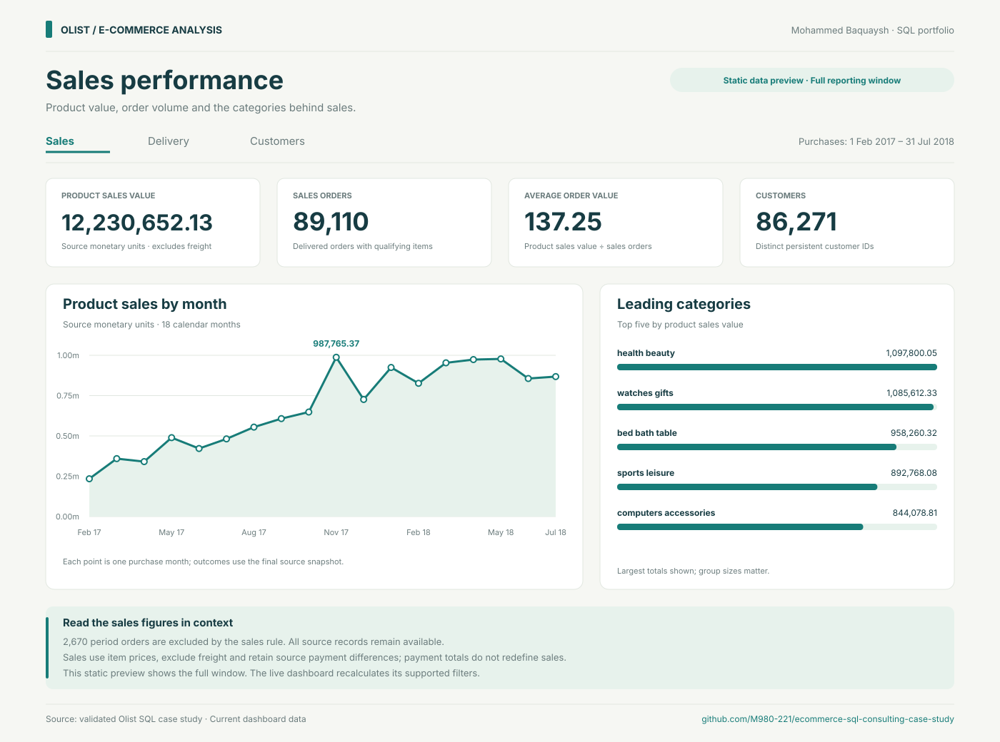
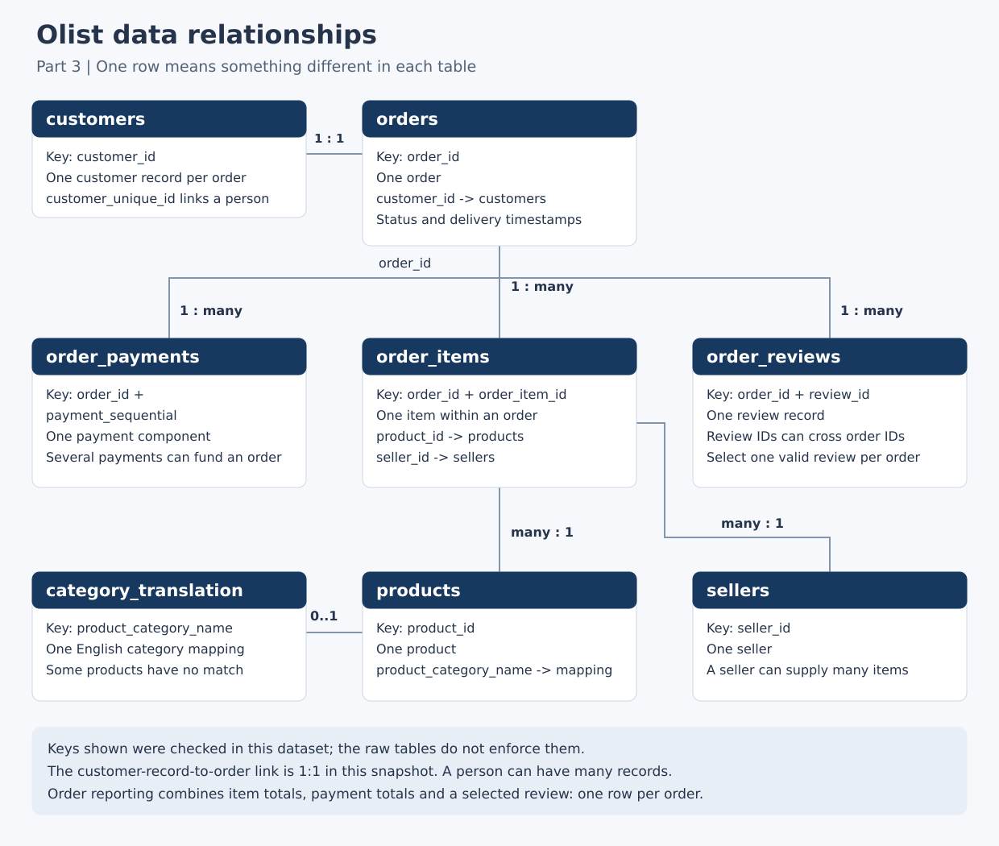

# E-commerce Performance Review

A SQL consulting case study by Mohammed Baquaysh, using Olist's historical marketplace data to examine sales performance, delivery reliability and customer experience.

**Business question:** Where should an e-commerce manager focus first to improve sales performance, delivery reliability and customer experience?

**Current stage:** Parts 1–8 implemented. The dashboard brings sales, delivery and customer analysis together, with month and buyer-state filters. Recommendations and the final presentation are next. Browser visual testing remains outstanding; calculation checks and labelled static previews are available.

## Explore the dashboard

The dashboard has three pages: **Sales**, **Delivery** and **Customers**. Filter the purchase months and buyer state, inspect the charts and tables, and download the current page's results as CSV. Customer groups are recalculated for each selection.

[Open the dashboard (private, owner access)](https://olist-commerce-review.mohammed-baquaysh.chatgpt.site) · [Source and local opening instructions](dashboard/README.md) · [Part 8 walkthrough](docs/15_part8_dashboard.md)

Download this repository and open `dashboard/index.html` in a modern browser. No database connection, installation or account is required for the local dashboard. The separate hosted Site uses owner-only access.



This image is a static preview of the checked data, not a browser screenshot. [Delivery preview](dashboard/screenshots/delivery-preview.svg) · [Customer preview](dashboard/screenshots/customers-preview.svg)

## Sales findings

The February 2017–July 2018 reporting window contains **89,110 qualifying delivered orders** and **12,230,652.13 in product sales value**, with an average order value of **137.25**. Amounts use source monetary units and exclude freight.

- Comparing February–July in both years, product sales value increased **134.42%**, orders increased **130.80%**, and average order value increased **1.57%**. Most of the observed increase came from order volume.
- Health and beauty was the largest category by product sales value (**8.98%**). The ten largest categories accounted for **62.49%**.
- Buyers in São Paulo state accounted for **37.84%** of product sales value. This measures where existing sales came from, not the size of the untapped market.

Read the [sales analysis and SQL walkthrough](docs/11_part4_sales.md), or open the [monthly results](results/part4_monthly_sales.csv) and [equal-period comparison](results/part4_comparable_periods.csv). These are descriptive findings from a historical snapshot; the data does not establish what caused the growth.

## Delivery findings

Of **89,102 eligible delivered orders**, **6,116 arrived late (6.86%)**. Average delivery duration was **12.88 days**. Among the late orders, the average delay was **10.98 calendar days** beyond the promised date.

- March 2018 purchases had the highest observed late rate: **18.96%**, or **1,328 of 7,003** eligible orders.
- São Paulo had more late orders (**1,524**) than Rio de Janeiro (**1,450**), but Rio de Janeiro's late rate was higher: **12.61% versus 4.12%**. Counts show the number of affected orders; rates show how common lateness was within each state.
- The seller investigation table includes **190 sellers** with at least 100 eligible single-seller orders each. It covers **52,408 orders (58.82%)** of the delivery population. The results do not establish who caused a delay.

The analysis excludes 2,670 non-delivered period orders and eight delivered orders with missing actual-delivery dates. See the [delivery findings and SQL walkthrough](docs/12_part5_delivery.md) for the definitions, coverage and runnable examples.

## Customer findings

The sales population contains **86,271 identifiable customers**. Of these, **2,562 placed at least two eligible orders (2.97%)** during the reporting window. This is observed repeat purchasing, with less follow-up available for later buyers; it is not a lifetime retention measure.

- **88,494 orders have an eligible selected review**, giving **99.31% coverage**. The mean score is **4.15 out of 5**, and **13.03%** of reviewed orders scored 1 or 2. The 616 orders without an eligible review stay outside score averages.
- Selected reviews average **4.28 for on-time orders** and **2.23 for late orders**. Low scores account for **9.37%** and **63.66%**, respectively. **4,274 of the 5,972 selected late-order reviews (71.57%) were submitted before receipt**, so this comparison is not exclusively about post-delivery experience and does not establish causation.
- The customer-spending report shows the top 20 customers after combining all their eligible orders. It describes product value observed in this window, not predicted lifetime value.

See the [customer findings and SQL walkthrough](docs/13_part6_customers.md) for review coverage, repeat-purchase definitions and examples using JOIN and HAVING.

## Validation findings

Of **98,665 orders with items and payments**, 98,089 reconcile exactly, 273 differ by one cent and 303 differ by more than one cent. Independent calculations confirm that the differences exist in the source records. Their business causes remain unconfirmed; item prices and payments retain their original values.

Five order walkthroughs show exact reconciliation, JOIN duplication, small and larger differences, and a missing payment. Four reporting views keep order, item, delivery-category and customer measures at their intended grains. A measured order lookup demonstrates how a direct ID comparison uses an existing index; the timings apply to that lookup, not the full analysis. See [Part 7: validation and SQL walkthrough](docs/14_part7_validation.md).

## Completed work

- Defined six business questions, the intended stakeholder and working metric definitions.
- Imported eight source files into SQLite, preserving all 550,759 source records and 47 source columns.
- Verified source and database row counts, decoded field values and database integrity.
- Recorded source provenance, checksums, environment versions and reproducible import instructions.
- Profiled all 47 source fields and built cleaned views with a model containing exactly one row per order.
- Documented review selection, missing-data rules and the February 2017–July 2018 reporting window.
- Passed 62 Part 3 checks and 14 automated tests; order-join totals match the source.
- Completed five sales queries and exported their results. All 139 result rows match a separate calculation from raw records; 15 Part 4 checks and 10 sales test cases passed.
- Completed five delivery queries covering overall outcomes, purchase months, buyer states, categories and single-seller orders. All 310 result rows match independent raw-record calculations; 25 checks and 12 delivery test cases passed.
- Completed five customer queries covering reviews, delivery comparisons, spending, repeat purchases and buyer states. All 56 result rows match independent raw-record calculations; 26 checks and 12 customer test cases passed.
- Investigated all 576 nonzero payment differences, checked five representative orders and reconciled the reporting views to the published analysis. The [Part 7 evidence](results/part7_validation.txt) records the checks; source records and metric definitions remain unchanged.
- Built the three dashboard pages with local data, shared filters, calculated customer groups and CSV downloads. [Part 8 checks](results/part8_validation.txt) compare the JavaScript calculations with SQLite across full, filtered and empty populations. Static previews are included; browser rendering and manual accessibility review remain open.

SQLite provides a portable database for this project. SQL defines the tables and inspection checks; a Python standard-library script handles CSV loading, including multiline reviews. Raw values remain TEXT. Part 3 views provide validated numeric values, NULL handling and metric-specific eligibility rules.

## Import results

| Table | Source records | Imported records | Rejected |
|---|---:|---:|---:|
| `orders` | 99,441 | 99,441 | 0 |
| `order_items` | 112,650 | 112,650 | 0 |
| `customers` | 99,441 | 99,441 | 0 |
| `products` | 32,951 | 32,951 | 0 |
| `sellers` | 3,095 | 3,095 | 0 |
| `order_payments` | 103,886 | 103,886 | 0 |
| `order_reviews` | 99,224 | 99,224 | 0 |
| `category_translation` | 71 | 71 | 0 |
| **Total** | **550,759** | **550,759** | **0** |

All eight tables matched their sources. The total is a count across tables; the dataset contains **99,441 orders**. SQLite's integrity check returned `ok`.

Evidence: [import log](results/part2_import_log.csv), [verification report](results/part2_verification.json) and [SQL check output](results/part2_validation.txt).

## Reproduce the setup

Requirements: Python 3.8 or later. The loader uses the standard library, so no additional Python packages are needed.

1. Clone this repository:

   ```bash
   git clone https://github.com/M980-221/ecommerce-sql-consulting-case-study.git
   cd ecommerce-sql-consulting-case-study
   ```

2. Download the [Olist dataset](https://www.kaggle.com/datasets/olistbr/brazilian-ecommerce). Extract the eight files listed in [data/README.md](data/README.md) into `data/raw/`.

3. Build and verify the database:

   ```bash
   python3 scripts/build_database.py
   python3 scripts/prepare_part3.py
   python3 scripts/analyse_sales.py
   python3 scripts/analyse_delivery.py
   python3 scripts/analyse_customers.py
   python3 scripts/validate_part7.py
   python3 scripts/export_dashboard.py
   ```

4. Open the resulting `ecommerce_olist.db` in a SQLite client and run:

   ```sql
   SELECT COUNT(*) AS total_orders FROM orders;
   ```

   Expected result for the recorded dataset version: `99441`. After Part 3, `SELECT COUNT(*) FROM v_order_analysis;` also returns `99441`. [Sqlime](https://sqlime.org/) supports opening a local SQLite file in the browser.

The loader refuses to overwrite an existing database. For a separate rebuild:

```bash
python3 scripts/build_database.py --output ecommerce_olist_rebuilt.db --results-dir results/rebuilt
```

Source CSVs and database files are excluded from Git. The source manifest records the version and file fingerprints used for the published results. Rebuild timestamps and database hashes can differ because the database records the import time.

The checked dashboard data is included, so opening it does not require rebuilding the database. To validate a rebuilt dashboard, use Node.js and run `python3 scripts/validate_dashboard.py` and `node --test tests/test_dashboard*.mjs`. The dashboard itself needs only a browser. See [Part 8 reproduction steps](docs/15_part8_dashboard.md).

## Part 3 outcome

The clean order model keeps all **99,441 orders** and combines customer details, item totals, payment totals and one valid review. The main comparison window contains **89,110 sales-eligible orders**. Missing delivery dates exclude eight of those from delivery measures.

Source exceptions are visible: 610 products have no category, 13 lack an English mapping, and 303 orders with items and payments differ by more than one cent. The original records remain unchanged.



## Project documents

| Document | Purpose |
|---|---|
| [Business brief](docs/01_project_brief.md) | Decision, audience, questions and scope |
| [Project plan](docs/02_project_plan.md) | Ten-part delivery plan |
| [Part 2: setup and import](docs/09_part2_setup.md) | Environment, import decisions and verification |
| [Part 3: cleaning and model](docs/10_part3_cleaning.md) | Decisions, reproduction commands, checks and practice queries |
| [Part 4: sales analysis](docs/11_part4_sales.md) | Findings, five output tables and SQL practice |
| [Part 5: delivery analysis](docs/12_part5_delivery.md) | Lateness, delivery time, comparison groups and SQL practice |
| [Part 6: customer analysis](docs/13_part6_customers.md) | Review coverage, spending, repeat purchases and SQL practice |
| [Part 7: validation and SQL review](docs/14_part7_validation.md) | Payment differences, five order traces, reporting views and measured lookup performance |
| [Part 8: dashboard](docs/15_part8_dashboard.md) | Three interactive pages, filter rules, calculation checks and static previews |
| [Data dictionary](docs/03_data_dictionary.md) | All 47 fields, verified keys, derived views and relationship diagram |
| [Metric definitions](docs/04_metric_definitions.md) | Implemented reporting period, eligibility flags and denominators |
| [Validation log](docs/05_validation_log.md) | Completed checks and remaining validation |
| [SQL scripts](sql/README.md) | Executable setup and future analysis stages |

## Progress

- [x] Part 1: Define the business problem.
- [x] Part 2: Download data and create the database.
- [x] Part 3: Clean, model and document the data.
- [x] Part 4: Analyse sales performance.
- [x] Part 5: Analyse delivery performance.
- [x] Part 6: Analyse customer experience.
- [x] Part 7: Validate results and improve SQL.
- [x] Part 8: Build the dashboard and validate its calculations; browser visual QA remains open.
- [ ] Part 9: Develop recommendations and slides.
- [ ] Part 10: Prepare the completed portfolio.

Fifteen business queries, combined validation and the three dashboard pages are implemented. Next come three recommendations and a five-slide presentation. Known source exceptions remain documented; passing checks do not establish the causes of payment differences.

## Data attribution

Source: [Brazilian E-Commerce Public Dataset by Olist](https://www.kaggle.com/datasets/olistbr/brazilian-ecommerce), version 2, downloaded on 1 October 2026. The dataset covers historical Brazilian marketplace activity. See [DATA_LICENSE.txt](DATA_LICENSE.txt) for the publisher's CC BY-NC-SA 4.0 licence.

This is an independent portfolio case study. Product sales value is reported separately from company revenue or profit.
