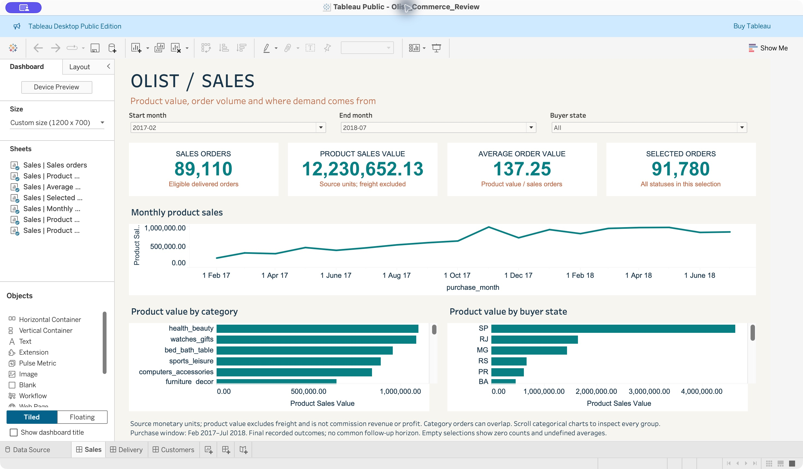
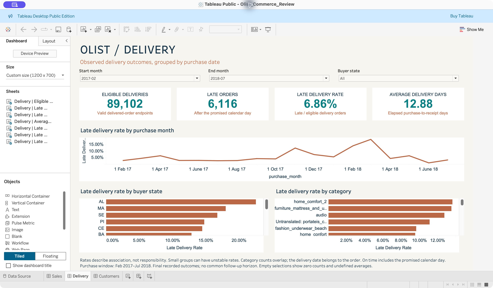
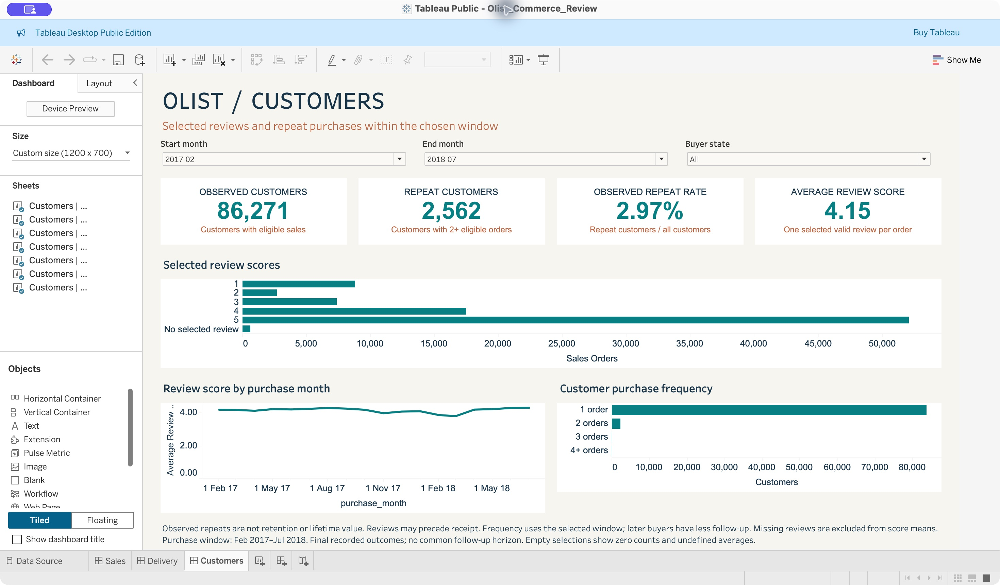

# Olist Tableau dashboard

[**Download the Tableau workbook**](https://github.com/M980-221/ecommerce-sql-consulting-case-study/raw/refs/heads/main/tableau/Olist_Commerce_Review_Validated.twbx) · [Open on a Mac](#open-on-a-mac) · [Calculation walkthrough](../docs/16_tableau_dashboard.md)

The finished workbook contains **Sales**, **Delivery** and **Customers** dashboards with shared **Start Month**, **End Month** and **Buyer State** controls. It was opened, saved and checked in **Tableau Public 2025.2 on Mac** on 10 October 2026.

## Dashboard screenshots

Captured directly from the finished workbook in **Tableau Public 2025.2 on Mac**. Every image uses **February 2017–July 2018 · All buyer states**. Click an image to open it at full resolution.

### Sales — volume, value and demand

**89,110 sales orders · 12,230,652.13 product value · 137.25 average order value**

Explore monthly product sales and compare contribution by product category and buyer state. Product value excludes freight and uses source monetary units.

### Delivery — late orders and delivery time

**89,102 eligible deliveries · 6,116 late orders · 6.86% late rate · 12.88 average days**

Compare lateness across purchase months, buyer states and categories. Rates use eligible deliveries within each group; category populations can overlap.

### Customers — reviews and repeat purchasing

**86,271 customers · 2,562 repeat customers · 2.97% repeat rate · 4.15 average review score**

Explore review-score distribution, monthly review scores and order frequency. Repeat purchasing is recalculated inside the selected period; missing reviews are excluded from the mean.

## Open on a Mac

1. Download `Olist_Commerce_Review_Validated.twbx`. On its GitHub file page, choose **Download raw file**.
2. Open Tableau Public, choose **File → Open**, and select the downloaded file.
3. Choose Sales, Delivery or Customers. The default selection is February 2017–July 2018 and all buyer states.
4. Change the month and state controls to explore the results. Keep Start Month on or before End Month.

The package contains the editable workbook, two Hyper extracts and `DATA_LICENSE.txt`. No database connection, separate data download or Python setup is required. The three dashboards use a 1200 × 700 layout with 21 editable worksheets: four KPI cards and three charts per dashboard. To inspect the worksheets, Control-click a dashboard tab and choose **Unhide All Sheets**.

## Verified figures

All three dashboards were checked at the defaults and again with both month controls set to March 2018 and Buyer State set to RJ.

| Measure | February 2017–July 2018, all states | March 2018, RJ |
|---|---:|---:|
| Sales orders | 89,110 | 864 |
| Product sales value | 12,230,652.13 | 113,062.84 |
| Average order value | 137.25 | 130.86 |
| Selected orders, all statuses | 91,780 | 907 |
| Eligible deliveries | 89,102 | 864 |
| Late orders | 6,116 | 298 |
| Late-delivery rate | 6.86% | 34.49% |
| Average delivery days | 12.88 | 24.30 |
| Observed customers | 86,271 | 850 |
| Repeat customers | 2,562 | 14 |
| Observed repeat rate | 2.97% | 1.65% |
| Average review score | 4.15 | 3.26 |

The [native verification record](../results/tableau_native_verification.json) identifies this exact package by its SHA-256 hash and records the application version, package contents and checked selections. These checks cover the displayed KPI values and dashboard layout for those two selections; they do not claim exhaustive native testing of every possible filter combination.

## Read the figures

- Sales use eligible delivered orders and item prices, excluding freight. Monetary values use source units.
- Delivery timing has its own eligibility rule. Receipt on the promised day is on time.
- Reviews are averaged over reviewed orders. Missing reviews remain missing; responses may precede delivery.
- Repeat customers have at least two eligible orders inside the selected months and state. This is observed repeat purchasing, not retention.
- Category delivery counts overlap when an order contains more than one category; they cannot be added as unique orders.

The order extract contains 91,780 rows and the category extract contains 89,830 order/category pairs. Keeping those sources separate prevents category membership from multiplying order-level measures.

## Source files and reproduction

The original `Olist_Commerce_Review.twb`, `Olist_Commerce_Review.twbx`, CSVs and scripts remain available as the reproducible draft build. Its official 26.1 schema and offline calculation checks are recorded in [the original validation report](../results/tableau_validation.txt). That draft required compatibility, extract and number-format repairs before it could be used in Tableau Public 2025.2.

Use **`Olist_Commerce_Review_Validated.twbx`** for the finished dashboard. This package includes the native saved workbook with those repairs, corrected KPI formats, centered labels and the fitted layout. Open this package to edit the finished worksheets. Running the original builder regenerates the CSV-based draft, not this final package.

The [source export checks](../results/tableau_export_validation.json) record 2,273,050 cell comparisons and 511 published-result comparisons. The [full walkthrough](../docs/16_tableau_dashboard.md) explains metric definitions, SQL practice and the original build commands.

The workbook is available here as a downloadable file; it has not been published to a Tableau Public profile.
